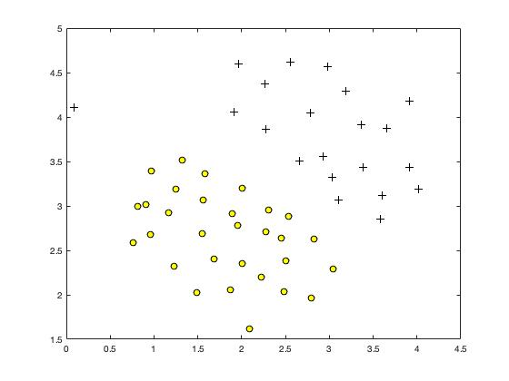
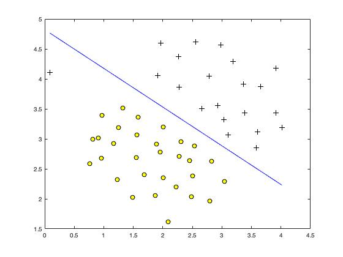
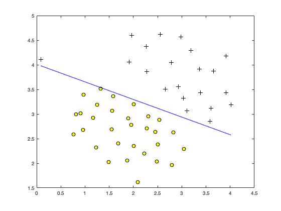
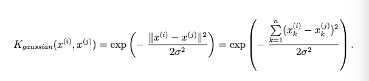
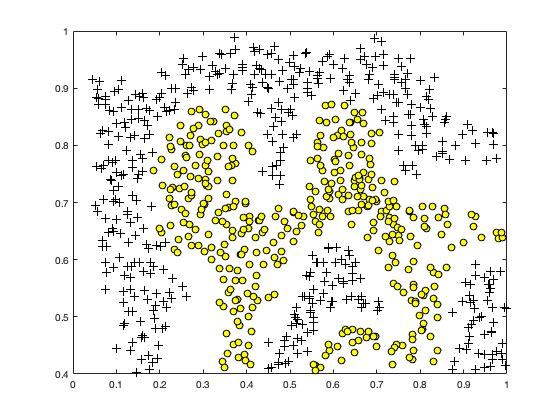
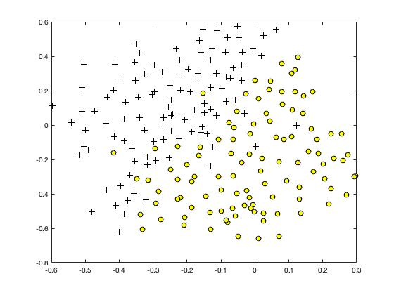
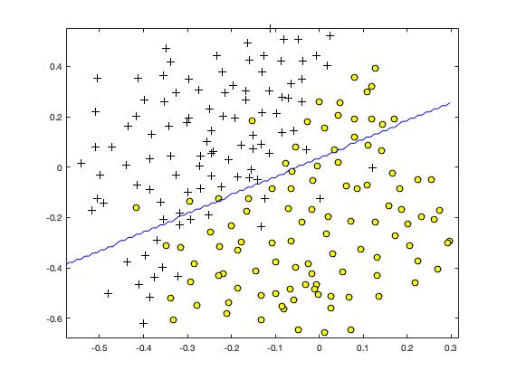

# Machine Learning (MATLAB) - Support Vector Machines

Machine Learning course from Stanford University on [Coursera](https://www.coursera.org/learn/machine-learning/home/week/7).

### Environment
- macOS Catalina (version 10.15.3)
- MATLAB 2018 b

### Dataset
- ex6data1.mat
- ex6data2.mat
- ex6data3.mat
- spamTrain.mat
- spamTest.mat
- emailSample1.txt
- emailSample2.txt
- spamSample1.txt
- spamSample2.txt
- vocab.txt

### Files included in this repo
- ex6.m - Octave/MATLAB script for the first half of the exercise 
- ex6data1.mat - Example Dataset 1
- ex6data2.mat - Example Dataset 2
- ex6data3.mat - Example Dataset 3
- svmTrain.m - SVM training function
- svmPredict.m - SVM prediction function 
- plotData.m - Plot 2D data 
- visualizeBoundaryLinear.m - Plot linear boundary 
- visualizeBoundary.m - Plot non-linear - boundary 
- linearKernel.m - Linear kernel for SVM

[⋆] gaussianKernel.m - Gaussian kernel for SVM

[⋆] dataset3Params.m - Parameters to use for Dataset 3

- ex6_spam.m - Octave/MATLAB script for the second half of the exercise
- spamTrain.mat - Spam training set
- spamTest.mat - Spam test set
- emailSample1.txt - Sample email 1
- emailSample2.txt - Sample email 2
- spamSample1.txt - Sample spam 1
- spamSample2.txt - Sample spam 2
- vocab.txt - Vocabulary list
- getVocabList.m - Load vocabulary list
- porterStemmer.m - Stemming function
- readFile.m - Reads a file into a character string
- submit.m - Submission script that sends your solutions to our servers 

[⋆] processEmail.m - Email preprocessing

[⋆] emailFeatures.m - Feature extraction from emails

## Part 1: Support Vector Machines
We will be using support vector machines (SVMs) with various example 2D datasets. Experimenting with these datasets will help us gain an intuition of how SVMs work and how to use a Gaussian kernel with SVMs.

### Part 1.1: Example Dataset 1
In this dataset, the positions of the positive examples (indicated with +) and the negative examples (indicated with o) suggest a natural separation indicated by the gap.
```
ex6data1.mat
```


- Figure: Example Dataset 1: SVM decision boundary

We will try using different values of the C parameter with SVMs. Informally, the C parameter is a positive value that controls the penalty for misclassified training examples. A large C parameter tells the SVM to try to classify all the examples correctly. C plays a role similar to 1/λ, where λ is the regularization parameter that we were using previously for logistic regression.


- Figure: SVM decision boundary with C = 1 (Dataset 1)

When C = 1, we find that the SVM puts the decision boundary in the gap between the two datasets and misclassifies the data point on the far left.


- Figure: SVM decision boundary with C = 100 (Dataset 1)

When C = 100, we find that the SVM now classifies every single example correctly, but has a decision boundary that does not appear to be a natural fit for the data.

### Part 1.2: SVM with Gaussian Kernels
We will be using SVMs to do non-linear classification. In particular, we will be using SVMs with Gaussian kernels on datasets that are not linearly separable.

#### Part 1.2.1: Gaussian kernel
To find non-linear decision boundaries with the SVM, we need to first implement a Gaussian kernel.

The Gaussian kernel as a similarity function that measures the “distance” between a pair of examples, (x(i),x(j)). The Gaussian kernel is also parameterized by a bandwidth parameter, σ, which determines how fast the similarity metric decreases (to 0) as the examples are further apart.

The Gaussian Kernal function:



##### gaussianKernel.m
```
% Gaussian kernel for SVM
diff = sum((x1 - x2).^2);
temp = 2 * (sigma.^2);
sim = exp(-(diff/temp));
```

Result: 
Gaussian Kernel between (x1 = [1; 2; 1], x2 = [0; 4; -1], sigma = 2.000000)-> *0.324652*


#### Part 1.2.2: Example Dataset 2
We will load and plot dataset 2.
```
ex6data2.mat
```

  
- Figure: Example Dataset 2: No linear decision boundary

From figure, we can obserse that there is no linear decision boundary that separates the positive and negative examples for this dataset. However, by using the Gaussian kernel with the SVM, we will be able to learn a non-linear decision boundary that can perform reasonably well for the dataset.

We already implemented gaussian kernal function above, let's proceed to train the SVM with the gaussian kernal function on this dataset.


- Figure: SVM (Gaussian Kernal) Decision Boundary (Example dataset 2)

Figure shows the decision boundary found by the SVM with a Gaussian kernel. The decision boundary is able to separate most of the positive and negative examples correctly and follows the contours of the dataset well.

#### Part 1.2.3: Example Dataset 3
We will load and plot dataset 3.
```
ex6data3.mat
```
  
- Figure: Example Dataset 3

In dataset3, variables X, y, Xval, yval are given. The provided code in ex6.m trains the SVM classifier using the training set (X, y) using parameters loaded from dataset3Params.m.

We are going to use cross validation set Xval, yval to determine the best *C* and σ parameter to use. 

For both C and σ, we try values in multiplicative steps (e.g.,0.01, 0.03, 0.1, 0.3, 1, 3, 10, 30). We try all possible pairs of values for C and σ (e.g., C = 0.3, and σ = 0.1). We would end up training and evaluating (on the CV set) a total of 8^2 = 64 different models.

##### dataset3Params.m  
```
% Parameters to use for Dataset 3
fprintf('suggests best [C, sigma] values\n');
dim_result = eye(64,3);
error_min = 0;
values = [0.01 0.03 0.1 0.3 1 3 10 30];

for C_val = values
    for sigma_val = values
        
        fprintf('Train and evaluate (on cross validation set) for\n[C_val, sigma_val] = [%f %f]\n',C_val,sigma_val);
        error_min = error_min + 1;
        model = svmTrain(X, y, C_val, @(x1, x2) gaussianKernel(x1, x2, sigma_val));
        predictions = svmPredict(model, Xval);
        pred_error = mean(double(predictions ~= yval));
        fprintf('prediction error: %f\n', pred_error);
        
        dim_result(error_min,:) = [C_val, sigma_val, pred_error];
    end
end

result_sort = sortrows(dim_result, 3);
C = result_sort(1,1);
sigma = result_sort(1,2);

fprintf('\nFound Best value [C, sigma] = [%f %f] with prediction error = %f\n', C, sigma, pred_error);
```

Result: 
Found Best value [C, sigma] = [1.000000 0.100000] with prediction error = 0.185000



- Figure: SVM (Gaussian Kernal) Decision Boundary (Example Dataset 3)


## Part 2: Spam Classification
Many email services today provide spam filters that are able to classify emails into spam and non-spam email with high accuracy. In this part, we will use SVMs to build our own spam filter.

You will be training a classifier to classify whether a given email, x, is spam (y = 1) or non-spam (y = 0). In particular, you need to convert each email into a feature vector x ∈ R^n.

we will run following script for this part:
```
ex6_spam.m
```

### Part 2.1: Preprocessing Emails

To know background about how to classify and implement spam email, go read section 2.1 of *ex6.pdf*.

To use an SVM to classify emails into Spam v.s. Non-Spam, we first need to convert each email into a vector of features. In this part, we will implement the preprocessing steps for each email. we complete the code in processEmail.m to produce a word indices vector for a given email.

##### processEmail.m
```
% Look up the word in the dictionary and add to word_indices if found

idx = strmatch(str, vocabList, 'exact');

if ~isempty(idx)
  word_indices = [word_indices; idx];
end
```

### Part 2.2: Extracting Features from Emails
You will now implement the feature extraction that converts each email into a vector in R^n. We will be using n = # words in vocabulary list. Specifically, the feature xi ∈ {0, 1} for an email corresponds to whether the i-th word in the dictionary occurs in the email. That is, xi = 1 if the i-th word is in the email and xi = 0 if the i-th word is not present in the email.

##### emailFeatures.m
```
% Feature extraction from emails
for i = 1:size(word_indices)
    x(word_indices(i)) = 1;
end
```
Result: the feature vector had length 1899 and 45 non-zero entries.

### Part 2.3: Training SVM for Spam Classification
Since we already implemented processEmail.m and emailFeatures.m functions, we will load a preprocessed training dataset that will be used to train a SVM classifier. 

*spamTrain.mat* contains 4000 training examples of spam and non-spam email, while *spamTest.mat* contains 1000 test examples. 

After loading dataset, ex6_spam.m will proceed to train a SVM to classify between spam (y = 1) and non-spam (y = 0) emails. 
We should see that the classifier gets a training accuracy of about 99.8% and a test accuracy of about 98.5%.

#### Part 2.4: Top Predictors for Spam
To better understand how the spam classifier works, we can inspect the parameters to see which words the classifier thinks are the most predictive of spam.

The next step of ex6 spam.m finds the parameters with the largest positive values in the classifier and displays the corresponding words. Thus, if an email contains words such as “guarantee”, “remove”, “dollar”, and “price”, it is likely to be classified as spam.

### Try our own emails
Now that we've trained the spam classifier, we can use it on your own emails! In the starter code, we have included spamSample1.txt, spamSample2.txt, emailSample1.txt and emailSample2.txt as examples. The following code reads in one of these emails and then uses your learned SVM classifier to determine whether the email is Spam or Not Spam.

- Downloaded file from [SpamAssassin Public Corpus](http://spamassassin.apache.org/old/publiccorpus/20030228_spam.tar.bz2)  
- Try out one text file at a time (Note: rename the file) 
- Run the email through ex6_spam.m file. 

Result: 
```
Processed own1.txt

Spam Classification: 1
(1 indicates spam, 0 indicates not spam)
```
## Course Links 

1) Machine Learning by Stanford University on [Coursera](https://www.coursera.org/learn/machine-learning/home/week/7).

2) [Support Vector Machines](https://www.coursera.org/learn/machine-learning/home/week/7)
(Please notice that you need to log in to see the programming assignment.) #ML-Support_Vector_Machines-MATLAB